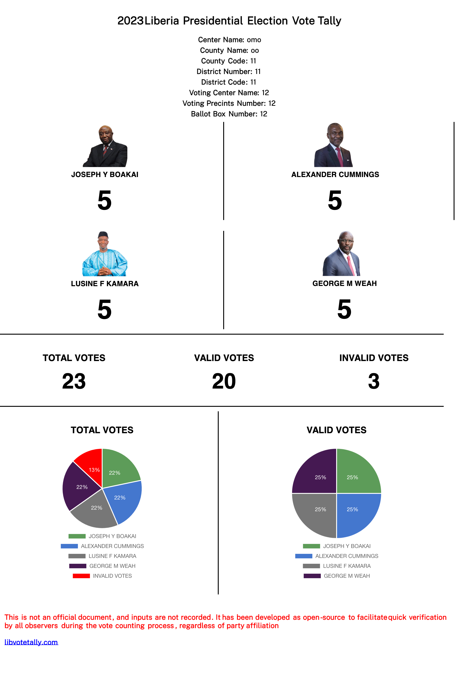

# Liberian Presidential Election Vote Tally 2023

**Disclaimer**: This project was originally developed based on the open-source project created by Ebru Kaya for the Turkish Presidential Election in 2023. It has been adapted to cater to the specific requirements of the Liberian electoral process.

## About

This open-source project aims to streamline and simplify the vote tallying process during the Liberian Presidential Election of 2023. Drawing from the experiences of our team members and collaborators, we have made adjustments to the original project to ensure it aligns seamlessly with the unique needs of the Liberian electoral system.

## Key Features

- **Adaptation for Liberian Elections**: We have tailored the project to the specific requirements and intricacies of the Liberian electoral process to enhance its functionality and relevance.

- **Party-Agnostic Design**: This tool is designed to be non-partisan, ensuring that all election observers, regardless of their political affiliations, can easily use it to expedite the vote counting process.

- **Open Source**: The project is open-source, allowing anyone to contribute to its development, suggest improvements, or report any overlooked details.

